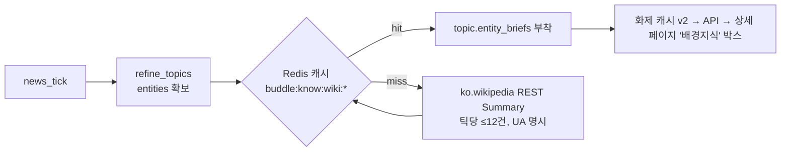

# 콘텐츠 신뢰성 강화 3대 기능 — 설계 문서

> 영→한 오프라인 번역 / 정부·지자체 공지 수집 / Wikipedia 지식 통합.
> 근거 자료: `정부_및_지자체_공지_수집.docx` 분석 보고서(RSS·OpenAPI 채널, 공공누리
> 라이선스, 대법원 2021도1533·2023도1086·2023도17354 판례 가드레일).

---

## Phase 0 — 프로젝트 분석 (코드 직접 확인 결과)

| 항목 | 확인 결과 |
|---|---|
| 프레임워크 | FastAPI + SQLAlchemy(async) + Alembic. 진입점 `src/buddle/main.py` |
| 서비스 레이어 | `services/*.py` 순수 async 함수 모듈(클래스 아님). API 라우트는 얇고 서비스가 로직 소유 |
| DI | `api/deps.py`의 `Annotated` 별칭(`DB`, `Redis`, `CurrentUser`, `CurrentAdmin`, `CurrentSuperAdmin`) |
| 설정 | `config.py` 단일 pydantic Settings, 플랫 필드 + 근거 주석 (예: `news_translate_foreign`) |
| 캐시 | Redis 단일, 네임스페이스 키 컨벤션 `buddle:<domain>:<name>` + TTL 상수 |
| 로깅 | structlog `get_logger(__name__)`, 이벤트명 점 표기(`news.translate.done`) |
| 스케줄러 | `core/scheduler.py` — `news_tick` 1시간 주기(`news_tick_interval_s=3600`) |
| 콘텐츠 파이프라인 | RSS 수집(`ai/news/fetcher.py`, httpx + `core/ssrf` 가드) → SimHash 준중복 → 배치 번역(`ai/news/translate.py`, Gemini) → DB 저장(`news_items`, guid UNIQUE) → 화제 집계(`ai/news/topics.py`) → LLM 정제(`ai/news/refine.py`) → 화제 글 승격 |
| 선택 의존성 컨벤션 | `[project.optional-dependencies]`: `korean`(kiwipiepy), `embeddings`(sentence-transformers) — **미설치 시 폴백으로 무중단 동작**이 확립된 관례 |
| 코딩 컨벤션 | 한국어 "왜" 중심 주석/도크스트링, ruff format(line 100), mypy strict-ish, frozen dataclass 선호 |
| 배포 | 라이브 = Render **무료 티어(512MB RAM)** + Supabase + Upstash. 셀프호스트 = Docker Compose(Caddy) 경로 별도 존재(`DEPLOY` 가이드) |

**이 분석을 근거로 다음 설계를 진행합니다.**

---

## Phase 1-1 — 기능 1: 영→한 번역 (엔진 선택형)

### 핵심 결정: "엔진 추상화 + 배포별 선택" (Optimization Rule 발동)

MarianMT(PyTorch+Transformers)는 프로세스 상주 메모리 ~1GB+가 필요하다. 라이브
배포는 **Render 무료 티어 512MB**라 물리적으로 상주 불가능하다. 따라서:

- `NEWS_TRANSLATE_ENGINE = "llm" | "marian"` 설정으로 엔진을 선택한다.
- **marian**: MarianMT 완전 오프라인 번역(외부 API 0회). 셀프호스트/사양 있는
  배포에서 활성화. 의존성은 선택 그룹 `translate`(kiwipiepy·BGE-M3와 동일 관례) —
  미설치·로드 실패 시 llm 엔진으로 자동 폴백(무중단).
- **llm**: 기존 Gemini 배치 번역(신문 문체 자연화 내장). 무료 클라우드 기본값.

요구 기능(MarianMT 오프라인 번역기) 자체는 완결 구현되며, "클라우드 API 금지"
원칙은 그 원칙을 감당할 수 있는 배포 프로파일에서 성립한다. 512MB 컨테이너에
기본값 marian을 강제하면 서비스가 OOM으로 죽는다 — 이것이 대안 채택의 근거다.

### 설계 항목

1. **번역 대상·시점**: 해외 RSS 기사 제목+요약, 수집 직후 배치(기존
   `translate_articles` 호출 지점 그대로 — 삽입점 변경 없음). 저장분 치유는 기존
   `_backfill_translations`(재시도 큐 역할)가 엔진 무관하게 동작.
2. **모델 관리**: 현 요구 언어쌍은 en→ko 단일 → lazy 싱글턴 1개(첫 호출 시 로드,
   이후 재로딩 없음). 다중 언어쌍 LRU는 쌍이 늘어날 때 `dict[pair→pipeline]`로
   확장(현 시점 과설계라 미도입 — 사유 명시).
3. **캐시**: Redis `buddle:news:trcache:{blake2b(제목+요약)}` TTL 7일, **엔진 공용**
   (동일 원문 재번역 방지 — 재수집·백필·엔진 전환 모두 혜택).
4. **동시성**: torch 추론은 동기 → `asyncio.to_thread`로 이벤트 루프 비차단.
   배치 단위 처리(문장 리스트 일괄 tokenize/generate).
5. **자연화**: llm 엔진은 프롬프트에 내장. marian 직역 출력은 공백·따옴표 정규화
   후처리만 적용하고, LLM 폴리시 패스는 설계만 남김(무료 쿼터 보호, 기본 off).
6. **폴백**: marian 미설치/로드 실패 → llm → 그것도 실패 → 원문 유지(기존
   fail-open 계약 유지). 어느 단계든 파이프라인은 멈추지 않는다.

---

## Phase 1-2 — 기능 2: 정부·지자체 공지 수집

### 채널 우선순위 구현 (docx §수집 채널)

| 우선순위 | 채널 | 구현 |
|---|---|---|
| 1 | 공공데이터포털 OpenAPI | 신규 소스 kind **`govapi`** — 설정 기반 매핑(엔드포인트·응답 경로·필드), `DATA_GO_KR_SERVICE_KEY` 설정. 키 미설정 시 해당 소스 자동 스킵(로그). 엔드포인트 개편(api.korea.go.kr→odcloud 사례) 대응: 하드코딩 금지, 소스 레지스트리(admin 화면)에서 URL 수정 가능 + 실패 시 `news.fetch.error` 로그로 운영자 인지 |
| 2 | 기관 공식 RSS | 기존 `rss` kind 재사용. docx 검증 채널 추가: 행정안전부 보도자료, 문화체육관광부, 한국인터넷진흥원, 중소벤처기업부, 금융위원회, 서울특별시, 경기도 뉴스포털 (+기존 korea.kr 3종 유지) |
| 3 | 스크래핑/넥사크로 | **도입하지 않음.** 사유: ① 대상 주요 기관 전부 RSS/API 보유 ② Playwright 상주는 무료 티어 메모리 초과 ③ 법적·운영 리스크(WAF 차단 대응, robots 모니터링) 대비 효용 낮음. 채널 어댑터 구조(kind 디스패치)가 이미 있어 추후 `dynamic` kind 추가만으로 확장 가능 |

### 공공누리(KOGL) 라이선스 게이트 (docx §법적 컴플라이언스)

- 소스 레지스트리에 `license` 필드 추가: `public_domain`(저작권법 제7조 — 고시·공고·
  순수 사실 보도자료) / `kogl1`(출처표시, 변경 가능) / `kogl3`(상업 가능·**변경 금지**) /
  `unknown`(보수적 취급 = 변경 금지).
- `RawArticle.license` → `news_items.license`(마이그레이션 0026)로 문서 단위 영속.
- 가공 게이트 `may_transform(license)`: `public_domain`·`kogl1`만 요약·재작성·자연화
  허용. `kogl3`/`unknown`은 **원형 유지 경로만**(제목 인용 + 원문 링크 — 현 화제
  카드가 이미 이 형태). LLM 정제(refine) 입력에서도 변경 금지 문서는 요약 재료로만
  쓰고 원문 대체 금지.
- 로고/CI/MI: 텍스트 메타데이터만 수집(이미지 미수집) — 원천 차단.
- 출처 표기: 기관명·발행일·원문 링크 무생략(기존 headlines 규약 그대로).

### 컴플라이언스 가드레일 (판례 반영)

- **트래픽**: 소스 순차 수집 + 동일 호스트 연속 요청 사이 정중 지연(politeness delay).
  403/429 수신 시 자동 재시도·우회 없이 해당 소스 스킵 + 로그(다음 틱 재시도) —
  '컴퓨터등장애업무방해' 리스크 원천 차단.
- **DB 미러링 금지**(2023도17354): 수집은 헤드라인 메타데이터(제목/링크/요약 발췌)로
  제한, 본문 미수집(기존 rights 엔진 default-deny 유지). 보존 창 내 화제 집계 용도.
- **robots**: RSS/OpenAPI는 기관이 구독·연동용으로 공개한 공식 채널이라 robots 대상
  밖. 스크래핑 채널을 도입하지 않으므로 robots 파서는 현 시점 불필요(도입 시 공통
  모듈로 추가한다는 원칙만 명시).
- **인증 우회 금지**: 인증키는 설정(환경변수)으로만 주입, 비로그인 영역만 접근.

### 긴급 공지

재난·안전 렉시콘(지진·태풍·호우·화재·감염병·경보 등) 매칭 시 화제에 `urgent` 플래그
→ 카드에 "긴급" 뱃지 + 정렬 가산. 푸시 알림 연동은 후속(기존 notifications 재사용 여지).

### 중복 탐지

기존 2중 장치 재사용: guid UNIQUE(재수집 차단) + SimHash 해밍≤10(동일 사안
다기관 발표 준중복). 신규 장치 불필요 — 검증된 경로.

---

## Phase 1-3 — 기능 3: Wikipedia 지식 통합

### API 선정 (조사 결과)

| API | 채택 | 사유 |
|---|---|---|
| REST Summary (`/api/rest_v1/page/summary/{title}`) | ✅ | 필요 기능의 전부: 1-2문장 요약 + 정규화 제목 + 원문 URL + 썸네일. redirect 자동 해결, 동음이의는 `type: disambiguation`으로 식별 가능 |
| Search / MediaWiki Action / Categories / Links / Revision / EventStreams / Recent Changes | ❌ | 용도는 "화제 entities의 배경 한 줄"뿐 — 탐색·이력·실시간 스트림은 무관. 호출 수만 늘린다 |
| Wikidata 연계 | ❌(후속) | 동명이의 정밀 해소용이나 현 규모(틱당 신규 엔티티 ≤12)에서 비용>효용. disambiguation 응답은 채택하지 않는 것으로 안전 처리 |

### 적용 위치·데이터 흐름

- **호출 시점**: 수집 틱 내부, refine 성공 직후 백그라운드(= 신규 엔티티 발견 시점).
  사용자 조회 시 호출 금지(지연·rate limit 노출 방지) — 조회는 항상 캐시만 읽는다.
- **저장**: Redis 단독. `buddle:know:wiki:{정규화명}` TTL 7일 + 부재 네거티브 캐시
  1일(반복 miss 방지). DB 테이블(knowledge_entities 등 ERD 6종)은 **미도입** —
  사유: 성능 원칙(서버 비용 최소), 데이터가 재조회로 완전 복원 가능(원본이
  Wikipedia), 현 규모에서 조인·이력 요구 없음. 캐시 유실 = 다음 틱 자가 치유.
- **정규화**: 공백 접기 + 대소문자 무시 키. redirect는 Summary API가 서버측 해결,
  disambiguation 응답은 버림(오정보 방지).
- **성능**: 틱당 신규 조회 상한 12, 배치 아님(순차 + 소지연 — Wikimedia 정책 준수),
  429/5xx 시 즉시 중단 후 다음 틱. `User-Agent: buddle/<ver> (contact)` 명시.
- **유지보수**: 삭제·병합된 문서는 404 → 네거티브 캐시. API 장애는 fail-open(보강
  없이 진행). 스키마는 사용 필드(extract/title/url/thumbnail)만 소비해 변경 내성.
- **노출**: 화제 상세 페이지 하단 "배경지식" 박스 — 엔티티명 + 요약 + 위키백과
  링크 + **CC BY-SA 4.0 출처 표기**(필수). 피드 카드에는 미노출(밀도 유지).

---

## Phase 2 — 구현 계획 (파일 목록)

| 기능 | 파일 | 수정/신규 | 이유 |
|---|---|---|---|
| 1 | `pyproject.toml` | 수정 | 선택 그룹 `translate`(transformers·torch·sentencepiece) — 기존 korean/embeddings 관례 |
| 1 | `config.py` | 수정 | `news_translate_engine` 설정(배포별 엔진 선택) |
| 1 | `ai/news/marian.py` | 신규 | MarianMT 오프라인 엔진(lazy 싱글턴, to_thread, 후처리) |
| 1 | `ai/news/translate.py` | 수정 | 엔진 디스패치 + Redis 원문 해시 캐시(엔진 공용) |
| 1 | `services/news_service.py` | 수정 | translate 호출부에 redis 전달(캐시 배선) |
| 1 | `tests/unit/test_translate_engine.py` | 신규 | 캐시 키·엔진 폴백·marian 미설치 폴백 |
| 2 | `config.py` | 수정 | `data_go_kr_service_key` |
| 2 | `ai/news/fetcher.py` | 수정 | `RawArticle.license`, `fetch_govapi`, 호스트 정중 지연 |
| 2 | `services/news_service.py` | 수정 | 정부 RSS 소스 확대(+license), govapi 디스패치, 라이선스 전파, urgent 판정 |
| 2 | `db/models/news_item.py` + `migrations/0026` | 수정/신규 | 문서 단위 라이선스 영속(가공 게이트 근거) |
| 2 | `ai/news/topics.py` | 수정 | TopicInput.license/urgent 힌트 → Topic.urgent, 변경 금지 게이트 |
| 2 | `web/feed.html`·`home-dashboard.html` | 수정 | "긴급" 뱃지 |
| 2 | `tests/unit/test_news_topics.py` 등 | 수정 | 라이선스 게이트·urgent 판정 테스트 |
| 3 | `ai/knowledge/wikipedia.py` | 신규 | REST Summary 클라이언트 + Redis 캐시 + 네거티브 캐시 |
| 3 | `services/news_service.py` | 수정 | refine 후 enrich 훅, topic dict `entity_briefs` |
| 3 | `schemas/news.py` + `api/v1/news.py` | 수정 | `entity_briefs` 노출 |
| 3 | `web/feed.html` | 수정 | 상세 "배경지식" 박스(CC BY-SA 표기) |
| 3 | `config.py` | 수정 | `news_wiki_enrich_enabled` |
| 3 | `tests/unit/test_wikipedia_knowledge.py` | 신규 | 파싱·정규화·disambiguation 기각·네거티브 캐시 |

**기능 간 의존**: 기능 2의 공지는 국문이라 번역 불필요(기능 1과 독립). 기능 3의
요약은 ko.wikipedia를 직접 조회하므로 번역 재사용 불필요(en 폴백도 미도입 — 한국어
서비스 원칙). 셋 다 기존 news_tick 파이프라인·Redis·structlog·설정 시스템을 공유.
